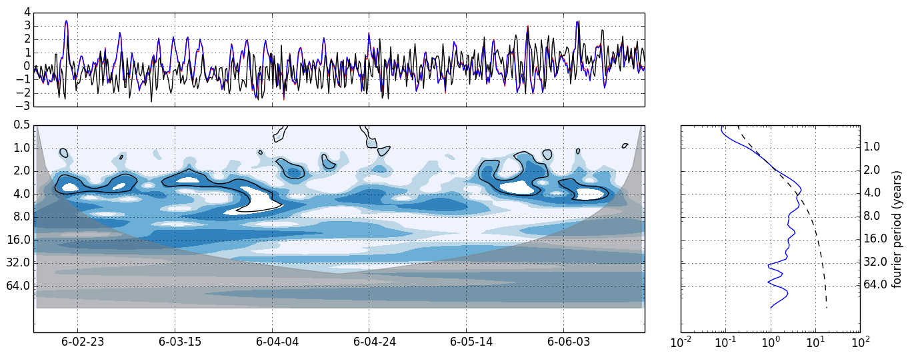
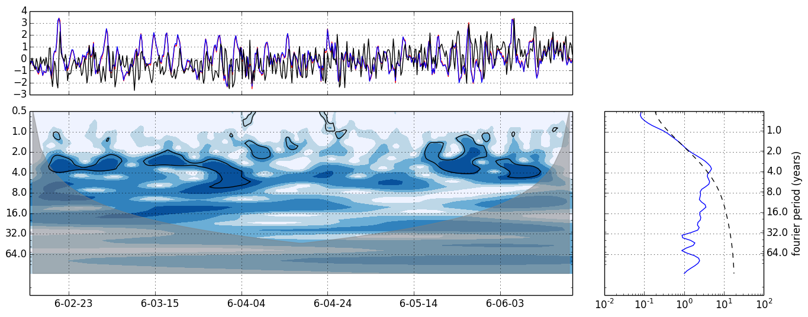
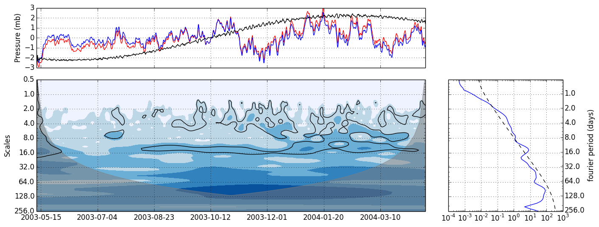
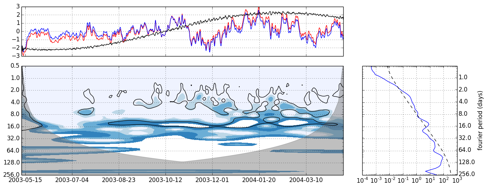
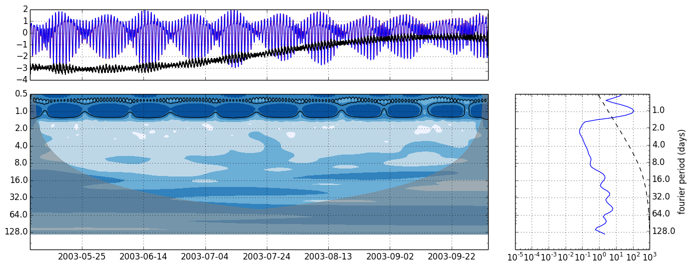
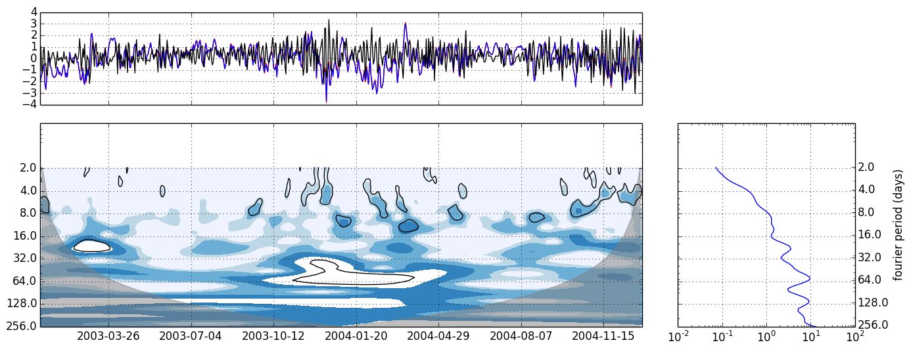
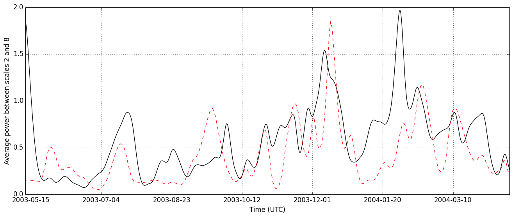

Wavelet Analysis (CWT):
-----------------------

##### Requirements to run analysis again
* Wavelet Analysis Routine [https://github.com/aaren/wavelets](https://github.com/aaren/wavelets) (modifications have been made to calculate significance contours - the original package is not in this repository)
* brewer2mpl for colormaps [https://github.com/jiffyclub/brewer2mpl](https://github.com/jiffyclub/brewer2mpl)
* Standard scientific packages (scipy, numpy, matplotlib) - scipy is used for autogression coefs
* User writen wave_signif module modeled after matlab code from Univ Colorado

#### Following a couple of different sources:

* [Univ Colorado wavelet page][TC_home] with Matlab Routines and examples.   
These where used for guidance in visualization as well as modifying code to compute the 95% confidence interval.

* As well as a __Wavelets.py__ "A Clean Python implementation of the wavelet analysis outlined in [Torrence
	and Compo][TC_98] (BAMS, 1998)" from [https://github.com/aaren/wavelets](https://github.com/aaren/wavelets)

[TC_home]: http://paos.colorado.edu/research/wavelets/
[TC_98]: http://paos.colorado.edu/research/wavelets/bams_79_01_0061.pdf

* Python has [PyWavelets](https://pypi.python.org/pypi/PyWavelets/) (for more complex transforms than I implemented)

#### Basic Implementation of __Wavelets.py__
Perform Wavelet Transform on normalized data with variance = 1.0.
Intrinsically pads with zeros for FFT

	After ingesting data from source (.txt, .nc, etc)
	# normalize data
	
	wa = WaveletAnalysis(x, time=time, dt=dt, dj=0.125) #dj should by dt/2

	# wavelet power spectrum
	power = wa.wavelet_power
	transform = wa.wavelet_transform

	# scales 
	scales = wa.scales

	# associated time vector
	t = wa.time

	# reconstruction of the original data
	rx = wa.reconstruction()
	
	--
	# determine acor factor for red noise
	acorr = acf(x) # <-- subroutine using scipy
	lagf = (acorr[1]+np.sqrt(acorr[2]))/2
	print lagf

	# determine contour locations for significance levels at 95%
	(signif, fft_theory) = wave_sig.wave_signif(x,dt,scales,lag1=lagf) # <-- subroutine modeled after matlab   	sig95 = np.ones_like(power) * np.array([signif] * len(t)).transpose()
	sig95 = power / sig95         # where ratio > 1, power is significant

	# plot however you see fit
 

#### Plotting

Plotting the powerspectrum as a function of scales (log2 base due to implicit FFT) and time.   
Using Nino3SST seasonal anomalies from the Univ of Colorado matlab code.	
If plotting normalized data with Variance Contours (like TC_98 fig2a)   

 
 
If plotting normalized data with quartile contours (like wavelet website)

  
##### General Comments

	Contour levels in BAMS are at normalized variances of 1, 2, 5, 10 ??? (fig2b)   
	
	Contour levels on web chosen to represent where 5%, 25%, 50%, 75% of wavelet
	power values are (eg. 95% of data is greater than a value, 1st quartile, median
	and 3rd quartile)

All data is normalized when plotted as wavelet power spectra (and is the power relative to white noise if power/sigma^2 or if data is normalized and sigma^2 = 1)

The variance listed in fig2b from TC_98 is the dataset variance.  Normalizing data by this value gives a normalized power spectrum. Contouring along [0,1,2,5,10] power/variance contours gives equivalent plots.

If instead of using variance contours the data is contoured at quartiles, then the output matches web source.  (power does not need to be plotted as log2 as matlab code suggests).

For Nino3SST - compared against red-noise spectrum with AR1 lag of .72 (as in TC_98) and is determined by an autocorrelation subroutine in the analysis code that finds `lag1 = (alpha1 + sqrt(alpha2))/2`

##### Questions/Issues/Concerns
In order to asthetically and scientifically display the contour maps, I've been battling among different colormap schemes: Colormap choice - `hot_r` vs `Greens or Blues` vs `jet` Its a question of being asthetic (jet is not in my opinon), potentially good for b/w printing (also not jet) and yet informative even when values are not significant. 

Possible inconsistency in programming from site… Matlab routine and IDL routines are not equivalent.  ~~Web output may vary slightly as it indicates it is using IDL.  (eg. significance is based on global wavelet spectrum, not red noise and at confidence int of .9)~~

M_6 Mooring
-----------

Data Source = 03sg5j_0114m_detide_f35.nc

   

Normalized data.  Contour intervals are at quartiles [0, .25. .50, .75, .95]. 95% Confidence Interval is contoured against a rednoise spectrum of alpha=.987 from `lag1 = (alpha1 + sqrt(alpha2))/2`

   

Normalized data.  Contour intervals are at [0,1,2,5,10].  95% Confidence Interval is contoured against a rednoise spectrum of alpha=.987

##### For fun I plotted the original data which wasn't detided

As expected, The daily and semi-daily tides dominate the signal.  The contours are quartile contours.

##### Questions/Issues/Concerns

When using ones own dataset, the online analysis does **not** normalize the data (this can be seen in the timeseries plot).  The wavelet analysis is consistant with unnormalized data (contour plot) but the global wavelet analysis seems to be using a variance of 1 (comparing magnitudes) perhaps it is assumed my data is normalized.  It does seem to auto calculate the ar1 coef. properly.  If I provide normalized data, the entire plot and contour levels is consistent.  This seems true for the Nino3 SST data as well (contour values are different but image is same - using nonnormalized data mathces contour intervals much more closely)

When interpreting, pay attention to power/variance relationship.  Understand that the data has been normalized.  The CI of 95% is against rednoise (but power may still be significant against white noise and high value contours may still be interpreted as such)

#### Analysis

From the data with tides still existant diurnal and semidiurnal tides are dominant and occupy the largest component of the signal.   When looking at the detided data there is power at periods greater than 1 month (although not rednoise significant).  Significant bands appear at ~14 days and between 2-8 days (with more power in the winter months).  Using sfc pressure at one nearby point as my proxy (52.5, 190.0) I believe these bands are probably related to synoptic forcing.  A preliminary comparison using Reanalysis daily surface pressure as a proxy for storms provides the following wavelet analysis:   

__Reanalysis__ sfc pressure anomalies

   

__Reanalysis__ 2-8 day scale averaged power (red) vs M6 2-8 day scale averaged power (black)

   

Preliminary correlation between the two using a scipy module `sp.stats.pearsonr(scale_ave1[0:-1:4], scale_ave2[130:474])` is .50   

My guess is the 2-8 day band is somewhat synoptic and the 14-18 day band is tidal (M20 tide?).

### Todo:

Completed: Calculate global wavelet significance and plot
Updated ChiSquare_Inverse test to use scipy package if desired

##### Reference

Although I did not use the Matlab/IDL/Fortran Code - I utilized it as a source thus:   

* Notice: Please acknowledge the use of this software in any publications:

	'Wavelet software was provided by C. Torrence and G. Compo, and is available at URL: http://atoc.colorado.edu/research/wavelets/'. Please send a copy of such publications to either C. Torrence or G. Compo:

### License ###

The MIT License (MIT)

Copyright (c) 2013 Aaron O'Leary (dev@aaren.me)

Permission is hereby granted, free of charge, to any person obtaining a copy of this software and associated documentation files (the "Software"), to deal in the Software without restriction, including without limitation the rights to use, copy, modify, merge, publish, distribute, sublicense, and/or sell copies of the Software, and to permit persons to whom the Software is furnished to do so,
subject to the following conditions:

The above copyright notice and this permission notice shall be included in all copies or substantial portions of the Software.

THE SOFTWARE IS PROVIDED "AS IS", WITHOUT WARRANTY OF ANY KIND, EXPRESS OR IMPLIED, INCLUDING BUT NOT LIMITED TO THE WARRANTIES OF MERCHANTABILITY, FITNESS FOR A PARTICULAR PURPOSE AND NONINFRINGEMENT. IN NO EVENT SHALL THE AUTHORS OR
COPYRIGHT HOLDERS BE LIABLE FOR ANY CLAIM, DAMAGES OR OTHER LIABILITY, WHETHER IN AN ACTION OF CONTRACT, TORT OR OTHERWISE, ARISING FROM, OUT OF OR IN CONNECTION WITH THE SOFTWARE OR THE USE OR OTHER DEALINGS IN THE SOFTWARE.
